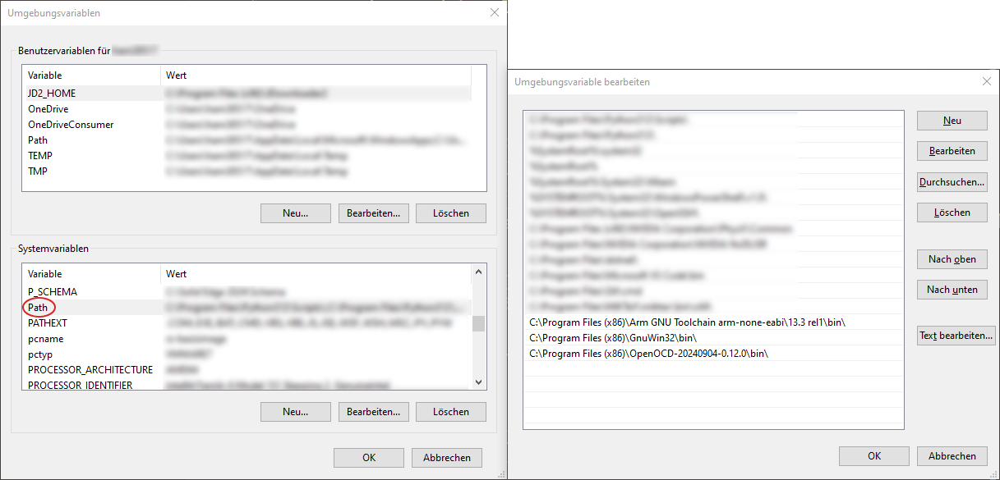

# FEARv2 Firmware
This repository contains the the firmware source code of the F(ield) E(mission) A(rray) R(egulation) current control circuit.

**Note:** This project is part of the SubModule-repository [FE-FEAR16v2][FE-FEAR16v2-SubmoduleRepo], where you can find sub-repositories for the design-files of the mainboard-PCB and shield-PCBs.


# Description
The project were developed with VS-Code and compiled/debugged with Make, ARM-Toolchain and OpenOCD. An explanation of how to set up the environment can be found below. The project is configured so that all C-Sources or include-paths are auto-detected by VS-Code (intellisense) and Make (compilation) which are located in up to 15 sub-folders of root. 


# Setup environment
This part teaches you how to setup the environment for own development, compiling, flashing an debugging. It is assumed that all tools are installed into their default location.
First, download the necessary programs and tools:
- [Visual Studio Download Page][VSCode]
- [ARM-Toolchain][ARM-Toolchain] (tested: v13.3.Rel1)
- [Make for Windows][Make] (tested: v3.81 via installer)
- [OpenOCD (precompiled)][OpenOCD] (tested: v0.12.0)
- [Texas Instruments ICDI Drivers][TI-ICDI] (tested:  v01.00.00.0A)
- [Git][Git] (optional)

You will also need to insert executable paths to the PATH-environment variable. You can find instruction from [Microsoft][AddToPathMicrosoft] or alternatively follow this [3rd party guide (with images)][AddToPath3rdParty]. (Tip: Install the tools first and remember the binary-paths as you can add them all at once.)


## Visual Studio Code
VS-Code is the GUI for development. Download the latest version (if you need `system` or `user` installer depends on your account-permissions) and install it.


## ARM-Toolchain
The toolchain provides compilers and debuggers. Download the latest installer and install the package. At the end of the installation:
- uncheck the `readme...` option
- keep `gccvar.bat` checked
- check the `add to path` option, if you want to add them to your user-PATH variables automatically. If you want to insert the path into the system-wide PATH-variable, uncheck the option and do it manually (you need to edit the PATH-variable later anyway which is noted later when all tools with PATH-insertions are installed).
- Keep `Add registry...` checked.

When a terminal opens, you can close it.
The default binary-path for PATH is: `C:\Program Files (x86)\Arm GNU Toolchain arm-none-eabi\13.3 rel1\bin\`


## Make
Make uses the project's `Makefile` to instruct the ARM-compiler to compile the sources and link them together into a binary file which can be flashed to the microcontroller. Download the latest version and install.
The default binary-path for PATH is: `C:\Program Files (x86)\GnuWin32\bin\`


## OpenOCD
OpenOCD handles the debugger-connection and hands it over to the ARM-Toolchain debugger (GDB). Download the latest archive and extract the contents into `C:\Program Files (x86)\`

The default binary-path for PATH is: `C:\Program Files (x86)\OpenOCD-20240904-0.12.0\bin\`


## TI ICDI Drivers for TIVA-LaunchPad
The ICDI drivers install the debug interface of the TIVA-LaunchPad, allowing OpenOCD to etablish a flash- or debugger-connection to the LaunchPad. Download the drivers, extract them in `Downloads` for instance and install them:
1. Connect the debug-USB-port of the LaunchPad to your PC and open you device-manager. 
2. You should see two `In-Circuit Debug Interface` you have to install.
3. Right-click on the first `In-Circuit Debug Interface` and `Update driver`
4. Choose `Search on my computer` and paste the foldername the drivers were extracted, check the `include subfolders` option and go on.
5. Allow the installation of device software in the subsequently popup.
6. Repeat step 1-5 with the 2nd `In-Circuit Debug Interface`.
   


## GIT (optional)
GIT can be used to clone the repositories and keep them up to date. Download the latest installer and follow the setup.


## Environment-variables test
Follow one of the guides ([Microsoft][AddToPathMicrosoft] or [3rd party][AddToPath3rdParty]) to insert the binary-paths into the PATH-variable. The result should look like:

**Note:** I've added them to system-PATH, but user-PATH works as well, but only for your current user.

Test if the binaries can be accesses via terminal by their name:
1. Open VS-Code (if it was already open during installation, restart it, so that code re-reads the PATH-variable)
2. Open a terminal (on german keyboard `ctrl` + `ö`)
3. Test if the tools can be exectuted by prompting:
   -  `make --version`. The result should look like:
      ```
      GNU Make 3.81
      Copyright (C) 2006  Free Software Foundation, Inc.
      This is free software; see the source for copying conditions.
      There is NO warranty; not even for MERCHANTABILITY or FITNESS FOR A
      PARTICULAR PURPOSE.

      This program built for i386-pc-mingw32
      ```
   -  `arm-none-eabi-gcc --version`. The result should look like:
      ```
      arm-none-eabi-gcc.exe (Arm GNU Toolchain 13.3.Rel1 (Build arm-13.24)) 13.3.1 20240614
      Copyright (C) 2023 Free Software Foundation, Inc.
      This is free software; see the source for copying conditions.  There is NO
      warranty; not even for MERCHANTABILITY or FITNESS FOR A PARTICULAR PURPOSE.
      ```
   -  `openocd --version`. The result should look like:
      ```
      Open On-Chip Debugger 0.12.0 (2024-09-04) [https://github.com/sysprogs/openocd]
      Licensed under GNU GPL v2
      libusb1 d52e355daa09f17ce64819122cb067b8a2ee0d4b
      For bug reports, read
      http://openocd.org/doc/doxygen/bugs.html
      ```


# How to use
## Building
Clone or download this git-repository and open the folder with VSCode-project. Press `ctrl` + `b` (german keyboard layout) to open the "run task" menu. Choose `build` or `rebuild`. Alternatively, you can open a terminal and type `make` (builds only changed sources), `make clean` (deletes build), `make rebuild` (deletes build and builds the entire projects.)

## Flashing and Debugging
Open any file from the project (VSCode uses this to determine the root-path) and press `F5` (Start debugging). By this, `build/FEAR-16.elf` is flashed onto the LaunchPad-µC and the debugsession is started.

## Commands
Commands are executed by the `terminal_runCmd` function in `terminal/terminal.c` and, on successful execution, acknowledged (`ack`) or, otherwise, not acknowledged (`nak`) after execution. The function contains an if-elseif tree, comparing the prompted input with implemented commands. Currently implemented commands are listed in the following table:

| Command                     | Description                                                | Example                   | Comment                                                         |
|-----------------------------|------------------------------------------------------------|---------------------------|-----------------------------------------------------------------|
| `echo <arg1> <arg2> ...`    | echo sends all given arguments back.                       | `echo Hello World`        | Output: `Hello World` &rarr; Useful for connection tests.       |
| `TERM:BAUD <arg1>`          | Sets the baudrate `arg1`.                                  | `TERM:BAUD 115200`        | Default baudrate: `115200`; Implemented but untested.           |
| `TERM:LINETERM <arg1>`      | Set the line-termination `arg1`                            | `TERM:LINETERM \r\n`      | Possible arguments: `\r\n`, `\n`, `\r`                          |
| `IDN?`                      | Returns Type and Firmware-Version of the device.           | `IDN?`                    | Output: `ack  Device,FEAR16v2,Firmware-Build,1.0.0.2`           |
|                             |                                                            |                           |                                                                 |
| `ADC:GET <Chain> <Channels>`| Returns the measured values of the requested chain (`CF`/`UDRP`) and channels (`Ch0..Ch15`). Channels can be given in the forms `Ch0,Ch4, Ch5`, `Ch0-Ch4` or `Ch0, Ch3-Ch5`.                                                     |                           |                                                                 |
|                             |                                                            |                           |                                                                 |

**Note:**
- The structure of the commands is based on SCPI commands.
- By default space is used as command-separator.


[//]: # (These are reference links used in the body of this note and get stripped out when the markdown processor does its job. There is no need to format nicely because it shouldn't be seen. Thanks SO - http://stackoverflow.com/questions/4823468/store-comments-in-markdown-syntax)
  [MC - Übungen zu Mikrocomputertechnik]: https://elearning.uni-regensburg.de/course/view.php?id=42784

[FE-FEAR16v2-SubmoduleRepo]: https://github.com/Dephrilibrium/FE-FEAR16v2

[VSCode]: https://github.com/microsoft/vscode/releases
[ARM-Toolchain]: https://developer.arm.com/downloads/-/arm-gnu-toolchain-downloads
[Make]: https://gnuwin32.sourceforge.net/packages/make.htm
[OpenOCD]: https://gnutoolchains.com/arm-eabi/openocd/
[Git]: https://git-scm.com/downloads
[TI-ICDI]: https://www.ti.com/tool/STELLARIS_ICDI_DRIVERS
[AddToPathMicrosoft]: https://learn.microsoft.com/en-us/previous-versions/office/developer/sharepoint-2010/ee537574(v=office.14)
[AddToPath3rdParty]: https://www.architectryan.com/2018/03/17/add-to-the-path-on-windows-10/